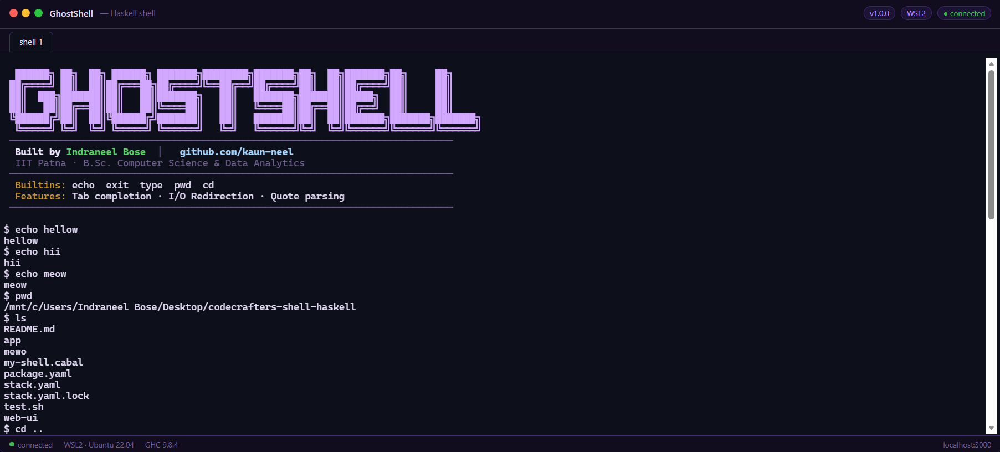

<div align="center">


<p><strong>A POSIX-style Unix shell built from scratch in Haskell</strong></p>

[](https://www.haskell.org/)
[](https://docs.haskellstack.org/)
[](LICENSE)
[](https://github.com/kaun-neel)
[](https://www.iitp.ac.in/)

</div>

---

## 👻 What is GhostShell?

**GhostShell** is a fully functional Unix shell built entirely from scratch in **Haskell**, featuring a beautiful web-based terminal UI. It supports real shell features like command execution, I/O redirection, quote parsing, and intelligent tab completion — all implemented without any shell libraries.

> Built as a deep-dive into systems programming, functional programming, and data engineering — bridging Haskell's type system with low-level shell mechanics.

---

## 🖥️ Web Terminal Preview

<div align="center">



</div>

---

## ✨ Features

| Feature | Description |
|---|---|
| **Interactive REPL** | Prompt-driven read-eval-print loop with colored output |
| **Builtin Commands** | `echo`, `exit`, `type`, `pwd`, `cd` — all implemented from scratch |
| **External Commands** | Full PATH resolution to find and execute any binary |
| **I/O Redirection** | `>`, `>>`, `2>`, `2>>`, `1>`, `1>>` — stdout and stderr redirection |
| **Quote Parsing** | Single quotes, double quotes, and backslash escape handling |
| **Tab Completion** | Completes builtins and PATH executables intelligently |
| **LCP Completion** | Longest Common Prefix completion for multiple matches |
| **Bell on No Match** | Rings bell `\x07` when no completion is possible |
| **Double TAB** | Shows all matching completions on second TAB press |
| **Web Terminal UI** | Beautiful browser-based terminal powered by xterm.js |

---

## 🚀 Getting Started

### Prerequisites

- [GHC](https://www.haskell.org/ghc/) >= 9.8.4
- [Stack](https://docs.haskellstack.org/) >= 2.x
- [Node.js](https://nodejs.org/) >= 20.x *(for web UI only)*

### Installation
```bash
# Clone the repository
git clone https://github.com/kaun-neel/ghostshell.git
cd ghostshell

# Install GHC (first time only, ~500MB)
stack setup

# Build the shell
stack build
```

### Running in terminal
```bash
stack exec my-shell
```

### Running the Web UI
```bash
cd web-ui
npm install
node server.js
```

Then open **http://localhost:3000** in your browser.

---

## 🏗️ Architecture
```
ghostshell/
├── app/
│   └── Main.hs          # Core shell — REPL, parser, builtins, tab completion
├── web-ui/
│   ├── server.js        # Node.js WebSocket bridge (shell ↔ browser)
│   └── index.html       # xterm.js browser terminal UI
├── package.yaml         # Haskell package config
├── stack.yaml           # Stack resolver config
└── README.md
```

### How it works
```
Browser (xterm.js)
      │  keypresses via WebSocket
      ▼
Node.js server.js
      │  stdin/stdout pipe
      ▼
Haskell Shell (Main.hs)
      │  PATH lookup, builtins, redirection
      ▼
Operating System
```

---

## 🔧 Shell Internals

### Parsing Pipeline
```
Raw input string
      │
      ▼
parseArgs        →  Tokenize respecting quotes and escapes
      │
      ▼
parseRedirect    →  Extract redirection operators and targets
      │
      ▼
handleCommand    →  Dispatch to builtin or external executor
```

### Tab Completion Logic
```
User presses TAB
      │
      ├── Check builtins first
      │       └── Exact one match → complete + trailing space
      │
      ├── Search PATH executables
      │       ├── One match       → complete + trailing space
      │       ├── Multiple matches → compute LCP → complete to LCP
      │       │       ├── First TAB  → ring bell
      │       │       └── Second TAB → print all matches
      │       └── No matches      → ring bell
      └── Done
```

---

## 📦 Tech Stack

| Layer | Technology |
|---|---|
| Shell engine | Haskell (GHC 9.8.4) |
| Build system | Stack LTS 23.18 |
| Web server | Node.js + Express |
| WebSocket | ws library |
| Terminal UI | xterm.js + xterm-addon-fit |
| OS | WSL2 Ubuntu 22.04 |

---

## 🧪 Testing
```bash
# Run the test suite
bash test.sh
```

Or test manually inside the shell:
```bash
# Test builtins
echo hello world
pwd
type echo
type cat
cd /tmp && pwd

# Test redirection
echo "hello" > /tmp/test.txt
cat /tmp/test.txt
echo "world" >> /tmp/test.txt

# Test tab completion
ech<TAB>        # completes to echo
exi<TAB>        # completes to exit
xyz<TAB><TAB>   # shows all xyz matches
```

---

## 👨‍💻 Author

<div align="center">

**Indraneel Bose**

B.Sc. Computer Science & Data Analytics
Indian Institute of Technology Patna

[](https://github.com/kaun-neel)

</div>

---

<div align="center">

*Built with 💜 in Haskell — because if it compiles, it works.*

</div>
